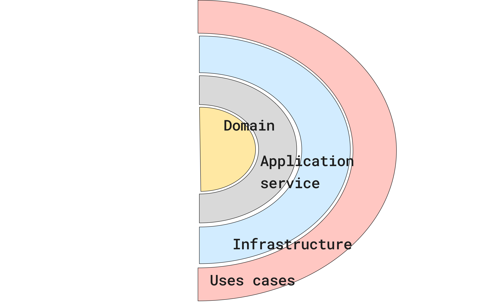

# API IN GOLAND

This project is dedicated to honing practical skills and mastery of Go principles. The primary aim is to immerse you in the real-world application of Go language features while building a resilient architecture inspired by the Clean/Onion architecture paradigms.

## Funcionality

Upon receiving a JSON payload, the API seamlessly processes the data and promptly returns the corresponding JSON structure. The main idea is to generate an effective mock for interacting with other APIs. Through this mock capability,  users to simulate interactions with external services, providing a versatile tool for comprehensive testing and facilitating realistic development scenarios.

## Architecture 

Clean Architecture is an architectural pattern that provides a structured way to design software systems. In simple terms, it promotes the separation of concerns by organizing code into distinct layers, each with its specific responsibilities. The main idea is to create a system where the core business logic is isolated from external concerns like databases, frameworks, or user interfaces.

- Entities: Represent the core business data and rules. This is where your business logic resides.
- Use Cases (Interactors or Application Business Rules): Contain application-specific business rules and orchestrate the flow of data between entities and the outside world.
- Interfaces (Adapters): Connect the internal parts of the system to the external world, such as databases, frameworks, or user interfaces.
- Frameworks and Drivers: The outermost layer that deals with external details like databases, web frameworks, or UI.

### Architecture changes

We've taken the foundation of clean architecture and carefully considered ways to maintain its core principles while highlighting the importance of use cases as the central element of our application. This approach ensures a quick understanding of what our app does.

The upcoming architecture will have four main parts:

- Use cases
- Domain
- Application
- Infrastructure: This includes the controller and interfaces, streamlining database connectivity and other essential functions crucial for achieving the API's goals.

These adjustments will preserve the strengths of clean/onion architecture, such as user-friendly testing, adaptability, and isolation. Testing becomes simpler, and the system easily adapts to changes, all while keeping distinct components separate for smoother maintenance.

## Endpoints

### GET /endpoint

Description of the GET endpoint.

### POST /endpoint

Description of the POST endpoint.

## Additional Information

Include any additional information or resources that users may find helpful.
